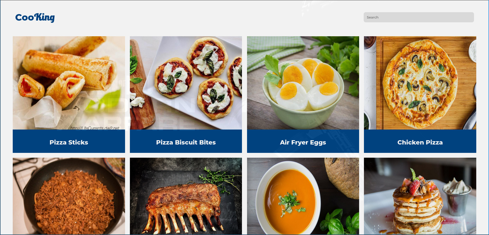
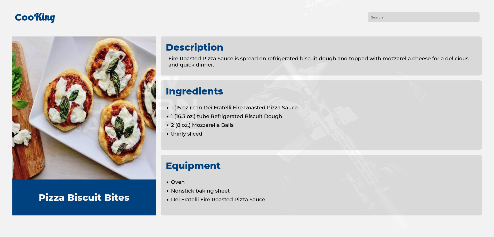
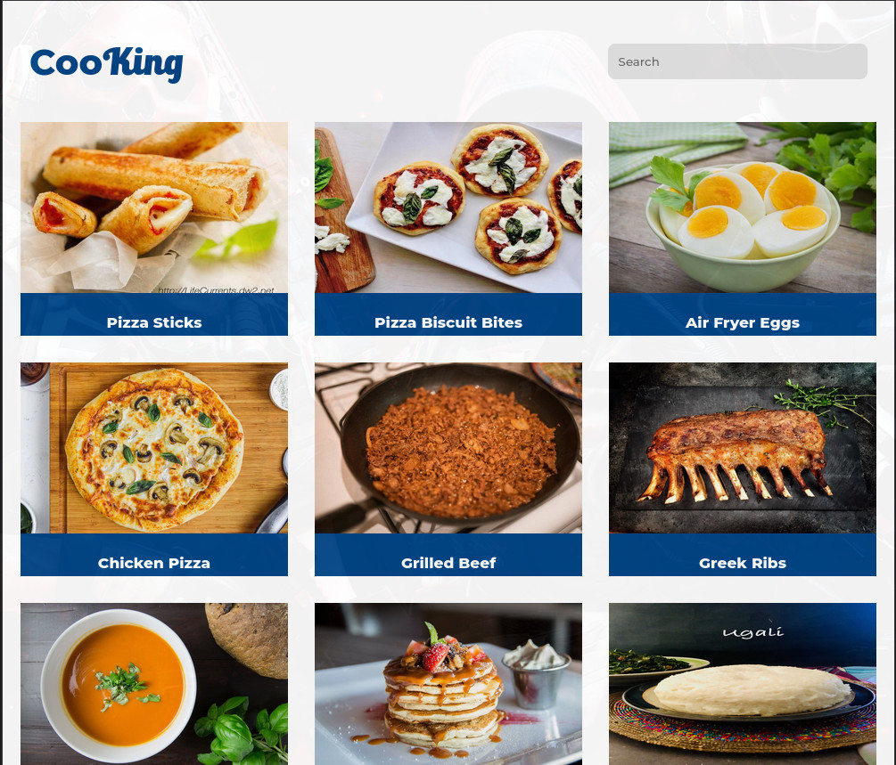
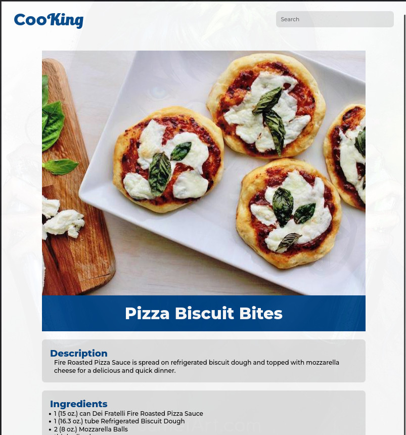
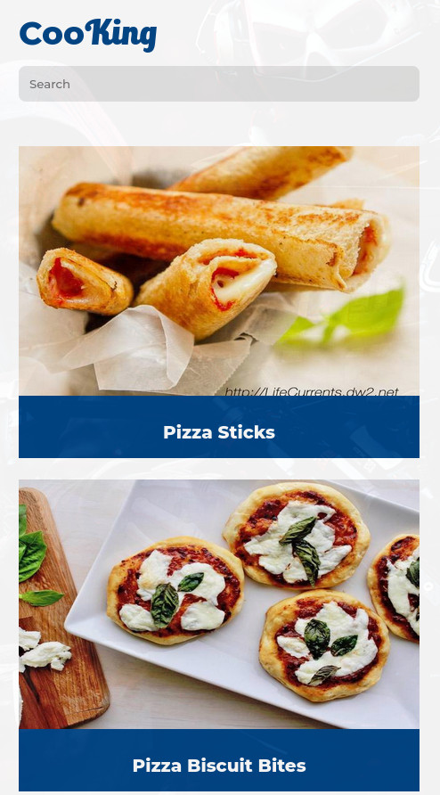
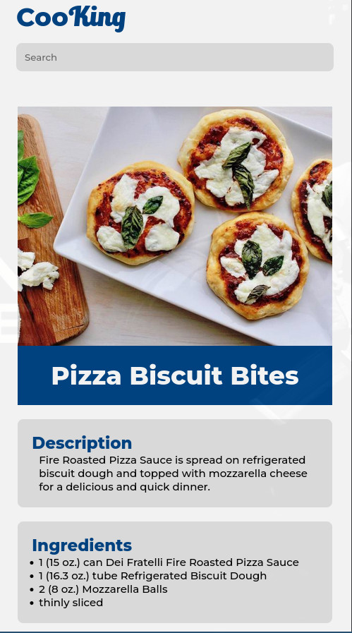

# PHP Recipe Display System - OOP

## Prompt
### Create a PHP Recipe display system:
- The system should display a list of recipe items. 
- These recipe items must have an image, title, description, 
ingredients, and cooking equipment needed.
- Have at least 10 recipes on your system
- Users of your system should be able to search for a recipe in your system, 
if the recipe is not available display a message to the user. 
- Ensure the best user experience in your system.

### Requirements
1. Use object-oriented approach.
2. Use an appropriate folder structure.
3. Ensure responsiveness on your system
4. Have good user interfaces.

## Structure
* `assets` - Contains images,fonts and css files 
* `classes.php` - Contains the classes that are used to create objects 
* `recipes.php` - Contains the objects that are created from the classes in `classes.php`
* `header.php` - Contains the references to css files 
* `footer.php` - Contains the javascript event listener for the `search` function
* `view.php` - Contains html/php code for view individual recipes. 

### Built with
- Semantic HTML5 markup
- PHP
- Css3
- CSS custom properties
- Flexbox

# Screenshots
### Desktop Version

### Tablet Version

### Mobile Version

